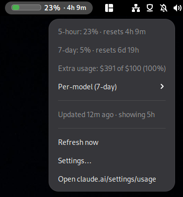

# Claude Usage Panel

A GNOME Shell extension that puts your Claude.ai subscription usage in the
top panel — a colored bar showing the current 5-hour window, plus a
secondary bar that appears when your 7-day usage crosses 50%.

Useful if you use Claude Code (or claude.ai itself) across multiple
machines and want a single, always-on view of where you stand against the
quota — equivalent to <https://claude.ai/settings/usage>, but visible at a
glance.



## Status

This is unofficial. It calls an undocumented endpoint that powers the
claude.ai usage page and is not part of any published Anthropic API. It
can break at any time if the endpoint changes. **Not affiliated with
Anthropic.** Use at your own risk and check claude.ai's terms of service
to make sure automated access fits your use case.

## Requirements

- GNOME Shell 48, 49, or 50 (tested on Fedora 44, GNOME Shell 50.x)
- `libsoup3` and `libsecret` — both ship with GNOME, no extra installs
  needed on a typical desktop
- A claude.ai account with an active subscription

## Install

### CLI (recommended)

Grab the latest release zip and let `gnome-extensions` install it:

```sh
curl -L -o /tmp/claude-usage@local.zip \
  https://github.com/serversathome-personal/claude-usage-panel/releases/latest/download/claude-usage@local.zip
gnome-extensions install --force /tmp/claude-usage@local.zip
```

Then log out and back in (Wayland has no extension hot-reload), and:

```sh
gnome-extensions enable claude-usage@local
```

### Manual unzip

If you'd rather drop the files in by hand:

```sh
mkdir -p ~/.local/share/gnome-shell/extensions/claude-usage@local
unzip claude-usage@local.zip \
  -d ~/.local/share/gnome-shell/extensions/claude-usage@local
```

Log out, log back in, then `gnome-extensions enable claude-usage@local`.

### From source

```sh
git clone https://github.com/serversathome-personal/claude-usage-panel.git \
  ~/.local/share/gnome-shell/extensions/claude-usage@local
```

Log out, log back in, then `gnome-extensions enable claude-usage@local`.

## First-time setup: cookies

The extension authenticates the same way your browser does: with two
claude.ai cookies stored in your GNOME keyring.

1. Open <https://claude.ai> in a browser and make sure you're logged in.
2. Open devtools (F12 or Ctrl+Shift+I).
3. Go to **Storage → Cookies → https://claude.ai** (Firefox) or
   **Application → Cookies → https://claude.ai** (Chrome/Chromium).
4. Copy the values of:
   - `sessionKey` — long string starting with `sk-ant-sid01-…`
   - `cf_clearance` — Cloudflare token, rotates every few hours/days
5. In the extension's **Settings…** menu (click the panel widget),
   paste both values into the password fields and click **Save & refresh**.

The cookies are stored in your GNOME keyring under
`service=claude-usage`, never written to disk in plaintext.

### When the panel shows `!`

The most common cause is that `cf_clearance` has rotated. Re-paste it via
**Settings…** and the panel will refresh. If the error message shown in
the menu mentions HTTP 401 instead, your `sessionKey` has expired —
log into claude.ai in your browser again and re-copy both cookies.

## What the panel shows

- **Bar (left, wider):** percentage of the rolling 5-hour quota used.
  Color smoothly grades from green to yellow to red as it fills.
- **Bar (right, narrower):** percentage of the 7-day quota — only visible
  once you cross 50%, since most of the time it's near zero.
- **Number:** the 5-hour percentage.
- **Countdown:** time until the 5-hour window resets.

Click the widget for more detail: per-window breakdown, extra-credit
balance if you have one enabled, and a per-model 7-day breakdown
(Sonnet / Opus / Haiku, with anything else collapsed under "Other").

## How it works

A timer in the extension fetches `/api/organizations/{org}/usage` every
60 seconds, parses the JSON, and writes a normalized snapshot to
`~/.cache/claude-usage.json`. The panel reads that cache. Both reads and
writes happen entirely inside `gnome-shell` (no external processes).

## Files

| File             | Purpose                                              |
|------------------|------------------------------------------------------|
| `extension.js`   | Panel indicator, polling timer, menu                 |
| `prefs.js`       | Adwaita settings dialog for cookie entry             |
| `fetcher.js`     | HTTP via libsoup3, secrets via libsecret, cache I/O  |
| `stylesheet.css` | Panel bar styling                                    |
| `metadata.json`  | GNOME extension manifest                             |

## License

GPL-2.0-or-later. See [LICENSE](LICENSE).
